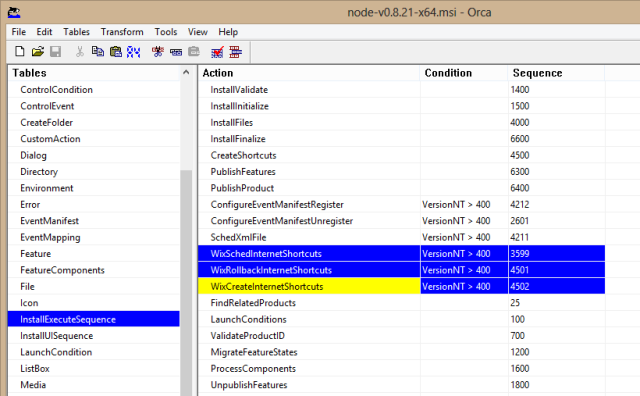

# Installing Hubiquitus on Windows
An already compiled, fully working version is available [Hubiquitus for Windows.zip (10.5 Mo)](https://mega.co.nz/#!XQRGUKgB!ZP6v7gExM-mMuAaX7LGNx0vSXOQV6XIKrJtqSJUkyKY). Use it if you have any trouble compiling hubiquitus on Windows.

Hubiquitus is originally made to work on Unix systems. To make it work on Windows, a few adjustments are needed.

1. Download Node.js [v0.8.22-x64](http://nodejs.org/dist/v0.8.22/x64/node-v0.8.22-x64.msi) (if you are in Windows 64-bits). This version is the best that suits with all our future actions.

2. Download Hubiquitus project as a Zip from GitHub

3. Edit package.json file as follows :

 a. Replace "zmq" dependency by "git://github.com/mscdex/zeromq.node.git".
For Windows 32-bits, try "git://github.com/matthiasg/zeromq-node-windows.git" **(untested)**

 b. Change socket.io module version to ">= 0.9.10" (not to be mistaken with **socket.io-client**)

4. Some dependencies use Git : On Windows a git client is needed, such as [MySysGit](https://code.google.com/p/msysgit/). During the installation choose option "Run Git from the Windows Command Prompt"

5. Node-gyp is a build tool for Node.js native addons. Its installation is needed for Hubiquitus but complex on Windows... Install in this order :
 - [Microsoft Visual Studio C++ 2010 Express](http://go.microsoft.com/?linkid=9709949)
 - [Windows 7 64-bit SDK](http://www.microsoft.com/en-us/download/details.aspx?id=8279). If installation fails, try to uninstall Visual C++ librairies 2010 x64 & x86 Redistributable versions 10.4.xxx.
 - For Windows 64-bits install [Compiler Update for the Windows SDK 7.1](http://www.microsoft.com/en-us/download/details.aspx?id=4422)

 Many issues have been encountered on the way to make "node-gyp" work properly. If it is impossible to re-compile, use the already compiled versions of *time* and *zmq* from the already compiled Hubiquitus for Windows here : [Hubiquitus for Windows.zip (10.5 Mo)](https://mega.co.nz/#!XQRGUKgB!ZP6v7gExM-mMuAaX7LGNx0vSXOQV6XIKrJtqSJUkyKY).


6. Start a command-line shell in Admin mode (use Powershell rather than Windows default command-line shell !) and go in your hubiquitus folder where package.json appears (use **dir** or **ls** to list files).

7. Run **npm install**. If no errors appear, you have just compiled Hubiquitus on Windows successfully !


# Use Hubiquitus in a Windows Azure Project

## Install Windows Azure SDK Development Kit for Node.js
Download Microsoft **Web Platform Installer**. This tool will be used to download installation packages.

Open Web Platform Installer (WPI) and find **"Windows Azure SDK for Node.js Software Development Kit"** (in French "Kit de développement logiciel Windows Azure SDK pour Node.js")
Currently this package is released on 24/04/2013 and contains in particular Windows Azure Powershell, Windows Azure Emulator and Windows Azure SDK for Node.js.

Installing the package will only install the dependencies you don't already have. If you ever happen to uninstall some dependencies manually, you won't be able to re-install them with WPI : "Windows SDK for Node.js" product will appear as "Installed" as long as Windows azure Powershell is installed. Uninstall it (can't be done with WPI) if you want to install it again with all its dependencies.

## Create a new Node.js project with Powershell

Windows Azure allows to deploy Node.js project, but these can't be managed with Visual Studio. No problem, as command-line tools are enough to de everything you want.

- Open Windows Azure Powershell as Administrator

- Create anywhere a *Projects* folder, and go inside : 
```
md Projects
cd Projects
```

- Create a new project 
```
New-AzureServiceProject testProj
```

- Add a Node.js Web Role to the project
```
Add-AzureNodeWebRole
```
If not specified, the default name for the Web Role is *WebRole1*

- The *server.js* file is the one launched at starting. You can replace the following line :
```
res.end(“Hello World”); 
```
by
```
res.end('</br>Hello from Windows Azure running node version: ' + process.version + '</br>');
```
This will print the Node.js version used on the system.

To start Windows Azure Emulator, run in your Azure Powershell
```
 Start-AzureEmulator -Launch
```
A "Hello world" page should launch automatically after about 30 seconds. You can then stop the emulator with :
```
 Stop-AzureEmulator
```

## Deploy your Node.js project on Azure
### Downloading the Windows Azure Publishing Settings


In order to deploy your application to Windows Azure, you must first download the publishing settings for your Windows Azure subscription. From your Windows PowerShell, run :
```
Get-AzurePublishSettingsFile
```
This will open a browser and download a file. You may be prompted to log in with your Microsoft Azure account.
Then import your downloaded file :
```
Import-AzurePublishSettingsFile [path to file]
```
### Publishing the Application
```
Publish-AzureServiceProject –ServiceName NodeHelloWorld –Location "East US” -Launch
```
Each of these parameters is optional : the default service name if the one specified when you first created your service (name of your local folder). You can specify an affinity group by `-AffinityGroup` instead of the location. The Launch parameter will launch your browser and navigate to the hosted service after deployment has completed.
This step can take 5 to 15 minutes.

### Stopping, deleting and Re-deploying Your Application
After deploying your application, you may want to disable it so you can avoid extra costs. Windows Azure bills web role instances per hour of server time consumed. Server time is consumed once your application is deployed, even if the instances are not running and are in the stopped state.
To stop the service :
```
Stop-AzureService
```
To delete the service :
```
Remove-AzureService
```

If you want to redeploy an existing service, first remove it to avoid problems. Note that it won't delete the storage account created


Find more informations about Node.js project on Azure [here](http://www.windowsazure.com/en-us/develop/nodejs/tutorials/getting-started/)

## Create a start-up task to install Node.js 0.8.9
### Create the start-up task
Windows Azure gives the choice between three versions of Node.js : 0.6.17, 0.6.20 and 0.8.4, the first one being the default version. Unfortunately none work with Hubiquitus. On Azure you will need to install your own version by creating a start-up task that will run at deployment on an Azure cloud service. The version tested with Hubiquitus for Windows is **0.8.22**. Current last version of Node.js v0.10.5 doesn't run with our zmq compilation for windows.

Edit file *ServiceDefinition.csdef* and add a new `<Task>` element before the other in the `<Startup>` element :
```
<Task commandLine="installnode.cmd" executionContext="elevated" />
```
Create a file *installnode.cmd* in the bin folder and write in it :
```
start /w msiexec.exe /i "%~dp0node-v0.8.22-x64.msi" /qn /l* "%~dp0installNodeLog.txt"
xcopy "%programfiles%\nodejs" "%programfiles(x86)%\nodejs" /s /i /Y
start /w msiexec.exe /i "%~dp0iisnode-dev-v0.1.21.msi" /qn /l* "%~dp0InstallIISNodeLog.txt"
netsh advfirewall firewall add rule name="Node.js" dir=in action=allow program="%programfiles%\nodejs\node.exe" enable=yes
```
### Download and modify the Node installer

The Node.js installer as you download it won't manage to install properly on Azure. You have to edit it with Orca, a database table editor for Windows installer packages. It needs to be installed first : the installer can be found along the Microsoft Windows SDK for Windows 7 and .NET Framework 4 binaries, in %ProgramFiles%\Microsoft SDKs\Windows\v7.1\Bin. You can also find in alone on the web. 
Once done, you can right-click the node.js installer and select the Edit with Orca menu.
An installer package is actually nothing more than a database of all the components and actions performed during the install. Just select the InstallExecuteSequence table on the right, and remove the 3 rows named *WixSchedInternetShortcuts*, *WixRollbackInternetShortcuts* and *WixCreateInternetShortcuts*.


Save your changes, and it's good to go.
Find more informations [here](http://macinsoft.blogspot.fr/2013/03/install-nodejs-on-windows-azure-cloud.html)


This script executes the following :
- Installation of Node.js 0.8.22
- Copy *nodejs* folder from *Program Files* to *Program Files (x86)*. This is needed because our zmq lib for windows and IIS need respectively Node.js in *Program Files* and in *Program Files (x86)*. This is why you need nodejs in both folders, as strange as it seems.
- Add a firewall rule to allow Node.js

IIS default configuration looks for Node.js in the *Program Files (x86)* In order to make it use the one from the *Program Files* folder, open *Web.config* and *Web.cloud.config* files in the Web Role folder

In each, add the following **iisnode** element
```xml
<configuration>
  ...
  <system.webServer>
  ...
    <iisnode nodeProcessCommandLine="&quot;%programfiles%\nodejs\node.exe&quot;"/>
```
**Warning :** if the **iisnode** element already exists, just add the *nodeProcessComandLine* attribute to it.

**Warning :** This doesn't make the previous copy of nodejs folder from *Program Files* to *Program Files (x86)* obsolete. You still have to do it. Without nodejs in the **Program Files (x86)* folder, IIS just won't start.

## Create a start-up task to add local IP to the topology.

On Unix systems, specifying local IP is optional since Hubiquitus actors will automatically detect their local IP and add it to their paramaters. However this automatic doesn't work on Windows since there is no default name for the default Ethernet card (depends on the language), and a specific patch is needed. This is done by creating another start-up task, that will launch a start-up.js file.

Add or modify (as it probably already exists) another task **at the end** of the others in the *ServiceDefinition.csdef* file.
```xml
<Task commandLine="node.cmd ..\startup.js" executionContext="elevated" />
```

Create or open a *startup.js* in your Web Role folder and write :
```js
function getIPFor(name) {
	var ip = undefined;
	var faces = require("os").networkInterfaces()[name];
	if (faces != undefined) {
		faces.forEach(function(face) { 
			if (face.family=="IPv4") {
				ip = face.address;
			}
		});
	}
	return ip;
}

fs = require('fs');
var jsonTopology = 1;
fs.readFile(__dirname +'/topology_front0.json', 'utf8', function (err,data) {
	if (err) {
		result =  err;
	}
	result = data;
	jsonTopology = JSON.parse(data);
	ip = getIPFor("Local Area Connection") || getIPFor("Connexion au réseau local"); // Add your language
	console.log("IP :   " + ip);
	jsonTopology.ip = ip;
	
	fs.writeFileSync(__dirname + "/topology_front.json", JSON.stringify(jsonTopology));
});
```

This code gets IP and add it to the topology.

## Create a start-up task to disable IIS timeout
IIS automatically shut your deployed service down after a while after a timeout which is about 15mn by default. Your service is automatically restarted if you access to your service URL (i.e http://xxxx.cloudapp.net/). However if you have opened other ports (for example 9999) in *ServiceDefinition.csdef*, accessing http://xxxx.cloudapp.net:9999 will **NOT** restart your service.

Thus, for some reasons you may want to disable this timeout, and this can be done once again with a start-up task. Add the following to your *ServiceDefinition.csdef* file :
```xml
<Task commandLine="disableTimeout.cmd" executionContext="elevated" taskType="background" />
```

Create *disableTimeout.cmd* in the bin folder and write in it :
```%windir%\system32\inetsrv\appcmd set config -section:applicationPools -applicationPoolDefaults.processModel.idleTimeout:00:00:00```

And the job is done !


 
